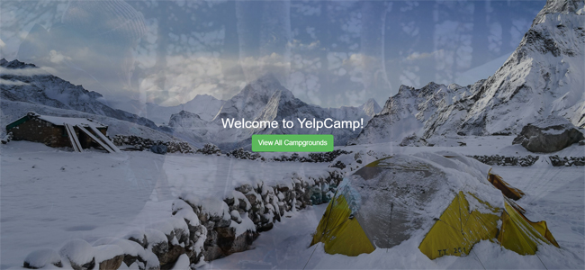
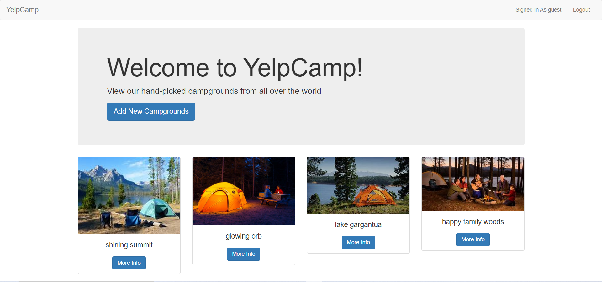
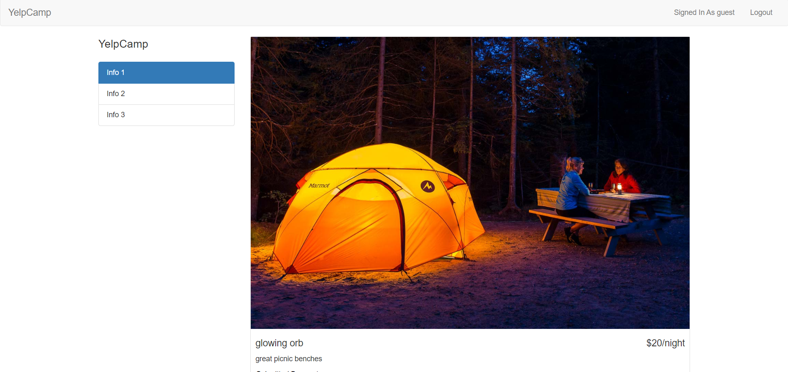

# Yelp Camp

## Description
A full-stack pedagogical social media appliction created with Node.js, Express and EJS.  Users can view details from popular camp sites uploaded by other credentialled users.  When a user signs up, she is able to create, read, update and delete posts relating to favourite camp sites.  Users can also comment on posts. 

##### Landing Page View

##### Campsite Index View

##### Single Campsite View

Visit site [here](https://yelp-camp-xo.herokuapp.com/)

## Table of Contents
  * [Installation](#installation)
  * [Usage](#usage)
  * [License](#license)
  * [Technologies](#technologies)
  * [Contributing](#contributing)
  * [Testing](#testing)
  * [Questions](#questions)
  
## Installation
Clone project to a directory on your local machine and cd into yelpCamp directory.  Run <$ npm install> to install dependencies.  See package.json for other available scripts.

## Usage
Run <$ npm start> to launch application in a development server at localhost:3001.  Click CTA button to view index of campsites.  Select a single campsite to view details.  Sign up or log in to add a favourite campground of your own, or comment on other users' posts.  

## License 
This project is covered under the MIT license 

## Technologies 
HTML5, CSS3, JavaScript, Node.js, Express, MongoDB, Mongoose, Passport

## Contributing
To see the guidelines adopted for contributing to this project, please view the [Contributor Covenant](https://www.contributor-covenant.org/version/2/0/code_of_conduct/code_of_conduct.txt)

## Testing
Tests coming soon

## Questions
Visit me at GitHub  
[christopherConcannon](https://github.com/christopherConcannon)
  
If you have any questions or would like to contact me, please email me at  
[cmcon@yahoo.com](mailto:cmcon@yahoo.com)

